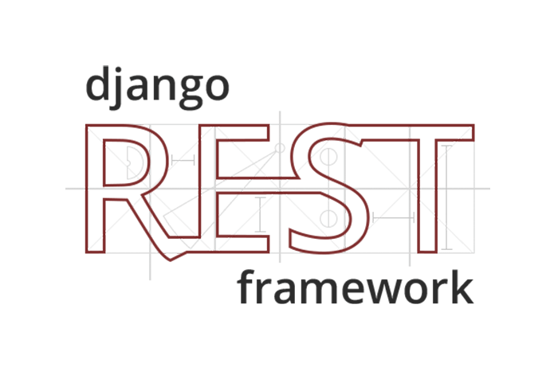

# DRF Book Api



**Bookland is bookstore that is built with Django REST framework**

## Features

- Authentication
- Full text search
- Add review for books
- Add books to favorite list
- Filtering and Pagination
- Pagination for nested serializer

## Technology Stack

- [Python 3.8](https://www.python.org/) , Programming Language. [](https://img.shields.io/badge/python-3.9-red)
- [Django 4.1](https://docs.djangoproject.com/en/3.2/releases/3.2/) , Web Framework.
- [Django Rest Framework 3.13.1](https://www.django-rest-framework.org/) , Web API.
- [Simple JWT](https://django-rest-framework-simplejwt.readthedocs.io/en/latest/), JSON Web Tokens.
- [Djoser](https://djoser.readthedocs.io/en/latest/introduction.html) , Views for authentication system.
- [PostgreSQL](https://www.postgresql.org/) , Database.
- [Pytest](https://docs.pytest.org/en/7.2.x/), Unit testing

## Setup

Clone the project

```bash
  git git@github.com:Hosseinht/bookland.git && cd bookland
```

Install dependencies

```bash
  pip install -r requirements.txt
```
Migrate

```bash
  python manage.py migrate
```

Start server

```bash
  python manage.py runserver
```

## Setup on Docker
**First install the Docker**
- [install Docker in Linux](https://docs.docker.com/engine/install/)
- [install Docker in Windows](https://docs.docker.com/desktop/windows/install/)
- [install Docker in Mac](https://docs.docker.com/desktop/mac/install/)

**docker-compose**
- [install docker-compose](https://docs.docker.com/compose/install/)

**Build and run the app**
```shell
docker-compose up -d --build
```

**If you don't want to use docker you need to change the database configuration in settings.py**


## Endpoints

To see the endpoints go to http://127.0.0.1:8000/swagger/